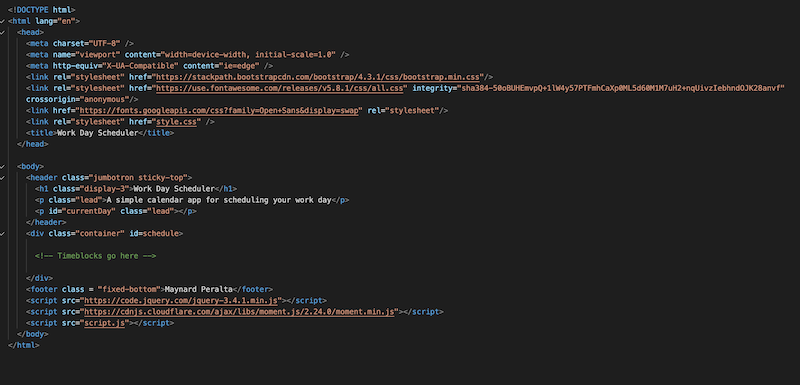
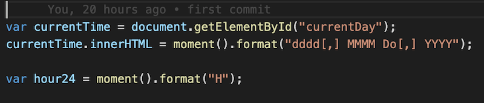
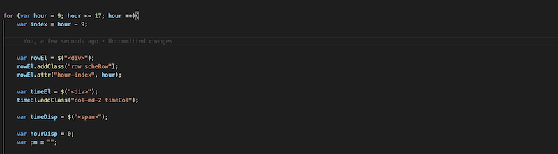
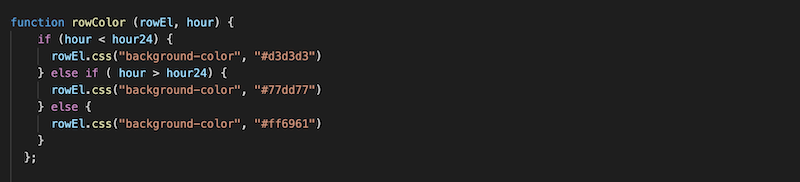
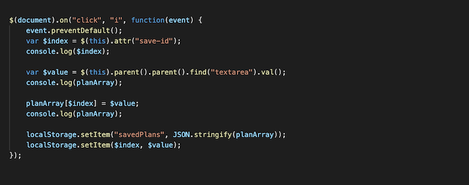
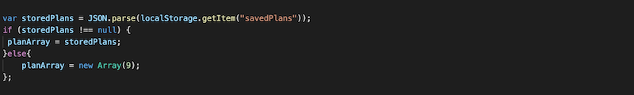

# Day Planner/Work Day Scheduler
## Overview

We were tasked with creating a Work Day Scheduler (which I mistakenly titled "Day Planner" due to the label of the demo gif in the homework assignment's README file). The assignemnt required us to dynamically generate HTML and CSS elements and classes using jQuery. The day had to be included at the top of the page, and the schedule had to have a text input for every hour of a normal business day (9 a.m. until 5 p.m.). Also, any saved inputs would presist even if the page was refreshed. We were also required to use MomentJS in order to display dates and times, as well as have the page reflect if hours were in the past, present, or future via color-coding.

## Process

The HTML and CSS files were already provided (the CSS included a lot of style code to get us started as well). The HTML also included cdn links for jQuery, Bootstrap, FontAwesome, and MomentJS. The only thing I added was a footer and that wasn't even required it was simply a design choice. 

The CSS on the other hand... I wound up writing a lot of my own CSS due to problems arising whenever I'd try to get the provided CSS to fit and function properly. It was good CSS practice, so I didn't mind. Ultimately, it allowed me to get the page to look a bit more personal and to my liking. 

The vast majority of this assignment was coded via jQuery. There was a lot of trial and error on this part because unlike the HTML and CSS, we weren't given anything to start with in the JavaScript file. It was completely blank. I started by getting the date to appear in the HTML file. This would allow me to get a feel for how MomentJS works.

Next I created a "for" loop in order to create all of the elements I would need in order to have a functioning schedule. I had already been provided the Bootstrap cdn, so I made sure to use Bootstrap-specific classes in order to work with a bootstrap grid to have a clean looking schedule. The loop would create rows, which would also have columns appended to them that would have the time, area to input text, and an icon to save the text. A snippet of the loop is below.

Because the assignment required us to color code if the times in the schedule were in the past, present, or future, I needed a function in order to reflect that. The provided CSS had classes for ".past", ".present", and ".future" but, in my limited knowledge (and to prevent pestering the learning assistants as much as I did for the previous assignments) I had to improvise in order to get the colors to reflect the real time of day (as provided by MomentJS). It's not perfect, but it works.

Finally, I had to figure out a way to save and hold the typed text, not only in the local storage, but it had to also remain on the page even if the page was refreshed. This was the most time consuming part of the entire assignemt. I received a ton of errors, undefined console logs, and "null" feedback. I lost sleep over this part of the assignment and had to resort to asking the learning assistants for help (my goal was to be able to complete this assignment without asking for excessive outside help other than looking up information online). The mistakes I made were not fully understanding how to tie "this" to parent elements, and also misakenly putting the code to retrieve the info from local storage at the very bottom of the JavaScript file. Once those issues were resolved, I finally had the text saving and displaying correctly.

After all of that was finished, all that was left was refactoring the code to clean up unnecessary bits, and some styling. The finished product is something that functions as intended.

## Final Thoughts

I didn't get as much time to work on this project as I had on previous assignments, so I felt a bit of pressure heading into the weekend. I'm a bit disappointed that I couldn't figure out how to use every provided CSS class in the project because they were provided for a reason. With the exception of the local storage bit (which I admit is a weak area of my knowledge at the moment), this homework project was a fair bit easier than the previous "Code Quiz" assigment. I did have to ask for assistance a few times due to being completely stuck, and I also did the suggested "Google Fu" that the instructors and TAs say is common. I hope the final result meets all acceptable criteria.