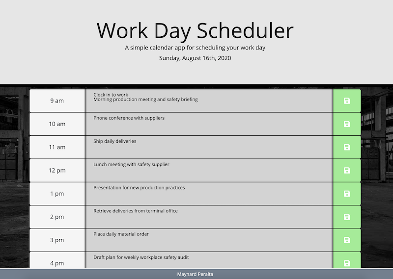

# Work Day Scheduler
## Introduction

This is a work day planner application which allows a user to type in tasks to do throughout normal business hours (9:00 a.m. - 5:00 p.m.) in one-hour increments. Text input into the timeblocks is saved to device local storage which allows it to be recalled upon refresh, or reopening the application on said device.

## Technologies Used
* HTML
* CSS
* JavaScript
* jQuery
* Bootstrap
* MomentJS
* Font Awesome

## Screenshots

 
Gif of app functionality

 

 
Screenshot of app with data input
 
 

## Deployed Application
The deployed application can be found [here](https://maynperalta.github.io/DayPlanner/)

## Contact Information

I can be contacted via email at <maynperalta@gmail.com>